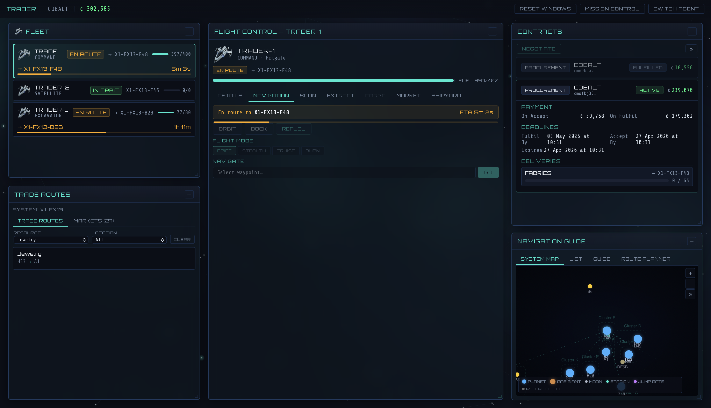

# SpaceTraders UI

A web-based dashboard for the [SpaceTraders API](https://spacetraders.io) — a programmable fleet-management game played through a RESTful API. Manage your agents, ships, contracts, and trade routes from a multi-window game interface.



## Features

- **Login & agent management** — Authenticate with an account token or agent token, register new agents, and quick-switch between saved agents
- **Draggable multi-window layout** — A 3-column dashboard with resizable, draggable windows persisted to localStorage
- **Fleet management** — View and control your ships
- **Flight control** — Navigate ships between waypoints and systems
- **Contracts** — Browse and manage available contracts
- **Trade routes** — View trading opportunities
- **System map** — Visual navigation of star systems
- **Animated star field** background and rate-limit overlay

## Tech Stack

- **React 19** with TypeScript
- **Vite** for dev server and builds
- **React Router** for client-side routing
- **TanStack React Query** with localStorage persistence (24-hour cache)
- **Vitest** + React Testing Library for unit tests
- **Playwright** for end-to-end tests

## Getting Started

```bash
# Install dependencies
npm install

# Start the dev server
npm run dev
```

## Scripts

| Command | Description |
|---|---|
| `npm run dev` | Start Vite dev server |
| `npm run build` | Type-check and build for production |
| `npm run preview` | Preview the production build |
| `npm run lint` | Run ESLint |
| `npm test` | Run unit tests |
| `npm run test:watch` | Run unit tests in watch mode |
| `npm run test:coverage` | Run unit tests with coverage |
| `npm run test:e2e` | Run Playwright end-to-end tests |
